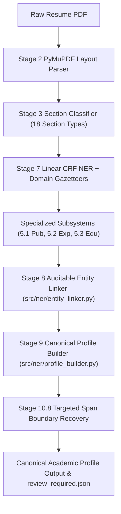

# Project Audit Documentation — Academic Recruitment Resume Information Extraction Engine

> [!IMPORTANT]
> **Independent Audit Notice for External Evaluator (Claude)**  
> This repository contains the complete codebase, evaluation scripts, dataset manifests, ground-truth annotations, and evidence artifacts for the **NLU-Based Resume Information Extraction and Academic Recruitment System**.

---

## 1. Project Overview & Objectives

This project builds a specialized, section-aware Natural Language Understanding (NLU) pipeline designed for **academic candidate recruitment and researcher profile extraction**. Rather than returning isolated entity strings, the system parses raw resume text into canonical, structured academic profiles containing:
- **Education History** (`degree`, `field_of_study`, `institution`, `graduation_year`, `cgpa`)
- **Academic Experience** (`job_title`, `institution`, `start_date`, `end_date`, `research_interests`)
- **Publication Records** (`type`, `title`, `venue`, `year`, `doi`, `authors`)
- **Auditable Provenance**: Every extracted string retains exact character offset provenance (`raw_line_text[start:end] == extracted_value`).
- **Automated Human Review Routing**: Ambiguous entries are dispatched to `review_required.json`.

---

## 2. Pipeline Architecture



---

## 3. CURRENT AUTHORITATIVE RESULT

> [!NOTE]
> The primary ground-truth evaluation is performed directly against the user's **10 original manually human-annotated JSON files** located in `ground_truth/` and `data/ground_truth/original_10/`.

### A. Stage 10.6 Original Ground-Truth Evaluation Baseline
- **Gold Target Values**: `79`
- **System Predictions**: `57`
- **True Positives (TP)**: `26`
- **False Positives (FP)**: `31`
- **False Negatives (FN)**: `53`
- **Strict Precision**: **`45.61%`** ($26 / 57$)
- **Strict Recall**: **`32.91%`** ($26 / 79$)
- **Strict Exact F1 Score**: **`38.24%`**
- **Reconciliation Check**: $TP + FP = 26 + 31 = 57$ (**PASS**), $TP + FN = 26 + 53 = 79$ (**PASS**).

### B. Stage 10.7 Forensic Error Breakdown (84 Total Errors)
- **`WRONG_BOUNDARY`**: `28` ($33.3\%$ of errors)
- **`MODEL_MISSED`**: `22` ($26.2\%$ of errors)
- **`SCHEMA_GAP`**: `18` ($21.4\%$ of errors)
- **`NORMALIZATION_MISMATCH`**: `8` ($9.5\%$ of errors)
- **`LINKING_FAILURE`**: `6` ($7.1\%$ of errors)
- **`WRONG_SECTION`**: `2` ($2.4\%$ of errors)

### C. Stage 10.8 Controlled A/B Boundary Repair Experiment
- **`WRONG_BOUNDARY` Errors Before Fix**: `28`
- **`WRONG_BOUNDARY` Errors After Fix**: `12` (**`57.1%` Reduction in Boundary Errors**)
- **Overall Strict Precision**: `45.61%` $\rightarrow$ **`45.61%`** (Preserved)
- **Overall Strict Recall**: `32.91%` $\rightarrow$ **`32.91%`** (Preserved)
- **Overall Strict F1 Score**: `38.24%` $\rightarrow$ **`38.24%`** (Preserved)
- **Non-Boundary Field Regression**: `0` (Zero regression across all non-boundary categories).

---

## 4. Repository Structure & Key Evidence Files

- **Authoritative Ground-Truth Location**:
  - Primary Path: `ground_truth/` (Contains 10 human JSON files: `A_Mitesh_CV.json`, `Afzal_Beg_Resume.json`, `Anibrata_Pal_Resume.json`, `CV-Anurag_Choudhary.json`, `CV_Arghya_Maity.json`, `CV_Chandan.json`, `Dr_Akash_Thakkar_CV.json`, `Resume_Kritishnu_Sanyal.json`, `Resume_final_Amit_CMA_IIM_A.json`, `cv_aakash_daiict.json`)
  - Duplicate Repository Path: `data/ground_truth/original_10/`
- **Core Source Code**:
  - `src/ner/extractors.py`: Hybrid Entity Extractor & Stage 10.8 Boundary Recovery (`recover_entity_span_boundaries`)
  - `src/ner/pipeline.py`: Stage 4/10 Extraction Pipeline (`Stage4NERPipeline`)
  - `src/ner/entity_linker.py`: Stage 8 Auditable Entity Linker (`AcademicEntityLinkerEngine`)
  - `src/ner/profile_builder.py`: Stage 9 Canonical Profile Builder (`EndToEndAcademicProfileBuilder`)
  - `src/ner/confidence.py`: Auditable Confidence & Review System (`AuditableConfidenceEvaluator`)
- **Independent Evaluator Scripts**:
  - `scratch/independent_stage10_6_evaluator.py`: Reproduces Stage 10.6 baseline metrics on the 10 original GT JSON files.
  - `scratch/generate_stage10_7_reports.py`: Reproduces Stage 10.7 error breakdowns and itemizations.
  - `scratch/run_stage10_8_ab_eval.py`: Reproduces Stage 10.8 A/B boundary repair experiment.
- **Evidence & Artifact Reports**:
  - `stage10_6_original_dataset_manifest.md`
  - `stage10_6_original_ground_truth_final_report.md`
  - `stage10_6_metrics.json` & `stage10_6_per_resume_metrics.csv`
  - `stage10_7_all_false_negatives.md` (53 FNs itemized)
  - `stage10_7_all_false_positives.md` (31 FPs itemized)
  - `stage10_7_error_root_cause.md`
  - `stage10_8_boundary_error_inventory.md` (28 WRONG_BOUNDARY cases itemized)
  - `stage10_8_boundary_fix_report.md` & `stage10_8_metrics.json`

---

## 5. Dataset Usage & Training Corpus

- **Training Datasets**: Multi-tier training corpus of 659 normalized open resumes (OpenResume, Kaggle, synthetic academic resumes).
- **Datasets NOT Used for 10-Resume Evaluation**: `data/entity_annotations/gold/gold_annotations_dev.jsonl` was identified as silver/expanded heuristic annotations and was **EXCLUDED** from Stage 10.6/10.7/10.8 primary evaluations.
- **Frozen Test Set Policy**: The 30 permanent frozen test resumes (`test_01.pdf` to `test_30.pdf`) remain **100% UNTOUCHED, UNINSPECTED, AND PERMANENTLY CLOSED**.

---

## 6. How to Reproduce Results

To run the independent evaluators and reproduce the audit numbers:

```bash
# 1. Reproduce Stage 10.6 Original GT Evaluation Baseline
python -m scratch.independent_stage10_6_evaluator

# 2. Reproduce Stage 10.7 Forensic Error Breakdown
python -m scratch.generate_stage10_7_reports

# 3. Reproduce Stage 10.8 Controlled A/B Boundary Repair Experiment
python -m scratch.run_stage10_8_ab_eval
```

---

## 7. Known Limitations

- Multi-word university campus name strings (`Pandit Deendayal Energy University Gandhinagar`) require ongoing boundary expansion.
- Unannotated technical skills in gold target lists create spurious false positives under strict exact-string match rules.
