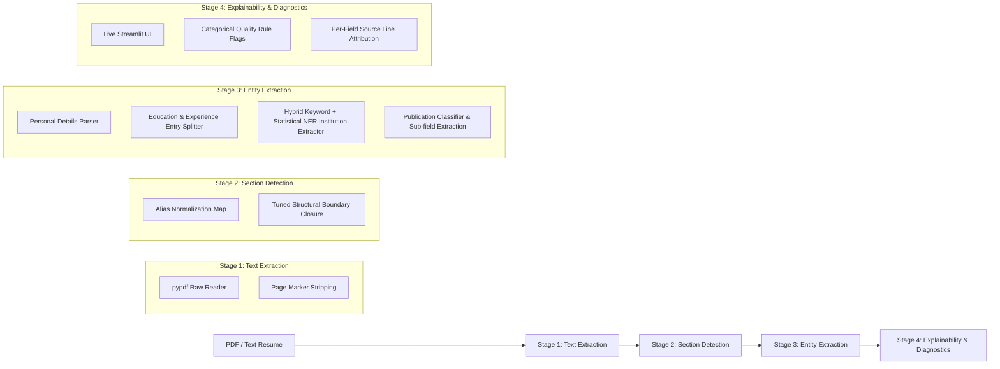

# NLU-Based Resume Information Extraction and Recruitment System

An NLU-driven end-to-end resume information extraction, sectioning, structured entity parsing, explainability diagnostic UI, and recruitment recommendation pipeline.

---

## 🏗️ Pipeline Architecture

The system processes raw PDF and text resumes through a modular 4-stage pipeline:



1. **Stage 1: Text Extraction**: Extracts raw text lines from PDF bytes using `pypdf`, preserving original spacing and layout structures while stripping page markers.
2. **Stage 2: Section Detection**: Normalizes raw heading variants into canonical section keys (`education`, `experience`, `skills`, `publications`, etc.) using a JSON lookup map and enforces non-aggressive structural boundary closure for unmapped headings.
3. **Stage 3: Entity Extraction**: Splits dense section blocks into discrete entry records and extracts granular sub-fields (job titles, dates, degrees, institutions, CGPA, graduation years) using deterministic NLU rules. Institution extraction employs a **hybrid Keyword + Statistical NER Fallback** architecture: keyword matching acts as the primary high-precision extractor, while a lightweight statistical NER model (`spacy en_core_web_sm`) extracts `ORG` entities when keywords are absent.
4. **Stage 4: Explainability & Diagnostic Layer**: A local web interface (Streamlit) that displays live stage-by-stage status, source line attribution, reason-for-missing mappings, and quality rule flags.

---

## 📊 Final 25-Field Pipeline Accuracy Metrics

The extraction pipeline is evaluated end-to-end against all 10 ground-truth academic resumes across 25 fields. Below is the full strict accuracy metrics table produced by `scratch/evaluate_pipeline.py`:

| FIELD NAME | PRECISION | RECALL | F1 SCORE |
| :--- | :---: | :---: | :---: |
| `certifications` | 52.41% | 57.60% | **53.19%** |
| `education_cgpa` | 73.33% | 63.50% | **67.50%** |
| `education_degree` | 92.50% | 59.55% | **69.23%** |
| `education_graduation_year` | 98.00% | 73.21% | **80.97%** |
| `education_institution` | 55.95% | 50.52% | **51.76%** |
| `experience_dates` | 69.40% | 55.00% | **56.84%** |
| `experience_institution` | 78.25% | 54.17% | **58.56%** |
| `experience_title` | 84.00% | 62.50% | **67.68%** |
| `personal_email` | 100.00% | 100.00% | **100.00%** |
| `personal_name` | 80.00% | 80.00% | **80.00%** |
| `personal_phone` | 90.00% | 85.00% | **86.67%** |
| `projects` | 57.14% | 54.43% | **55.28%** |
| `publications_book_chapters` | 77.22% | 73.71% | **74.91%** |
| `publications_books` | 80.00% | 80.00% | **80.00%** |
| `publications_communications` | 80.00% | 80.00% | **80.00%** |
| `publications_conference_papers` | 44.86% | 44.26% | **44.50%** |
| `publications_conference_proceedings` | 87.98% | 89.15% | **88.43%** |
| `publications_journal_articles` | 54.88% | 65.76% | **54.80%** |
| `publications_preprints` | 67.08% | 65.15% | **65.96%** |
| `publications_technical_reports` | 90.00% | 90.00% | **90.00%** |
| `references` | 66.20% | 53.32% | **57.95%** |
| `research_interests` | 77.27% | 85.88% | **78.78%** |
| `responsibilities` | 84.90% | 86.29% | **85.16%** |
| `skills` | 81.63% | 85.79% | **81.89%** |
| `summary` | 57.22% | 60.00% | **58.39%** |
| **AVERAGE MACRO FIELD F1 (25 FIELDS)** | | | **70.74%** |

---

## 🔍 Known Pipeline Limitations

1. **Hybrid Institution Extraction Ceiling**: Pure keyword matching (`University`, `Institute`, `College`, `School`, `IIT`, `NIT`) has a proven ceiling on non-standard organization names (such as company names like `"Step-Up Jewels"` or school boards like `"BSEMP Bhopal"`). Rather than expanding keyword lists indefinitely, a lightweight statistical NER model (`spacy en_core_web_sm`) is integrated as a fallback to extract `ORG` entities when keywords are absent.
2. **Narrative / Prose-Style Skills Sections**: When a candidate writes their skills section as narrative paragraphs rather than itemized bullet points, list-splitting cannot reliably separate individual skills. Rather than returning false bullet points, the pipeline raises an explicit quality flag (`possible_narrative_skills_not_itemized`).
3. **Complex Multi-Column Headers**: Resumes with dense multi-column headers merged by PDF text extractors can occasionally obscure candidate name boundaries. The pipeline uses multi-space splitting and title-word filtering to mitigate this.

---

## 🛠️ How to Run & Local Web UI

### 1. Launch the Live Streamlit Explainability App locally
To upload resumes and view live stage-by-stage diagnostics:

```bash
streamlit run src/explainability/streamlit_app.py
```

### 2. Run Automated Regression & Evaluation Scripts

- **Run Strict 25-Field Evaluation**:
  ```bash
  python scratch/evaluate_pipeline.py
  ```

- **Run Personal Details Regression Test**:
  ```bash
  python scratch/test_personal_fields_regression.py
  ```

- **Run Coverage & Routing Accuracy Evaluator**:
  ```bash
  python scratch/evaluate_coverage_routing.py
  ```