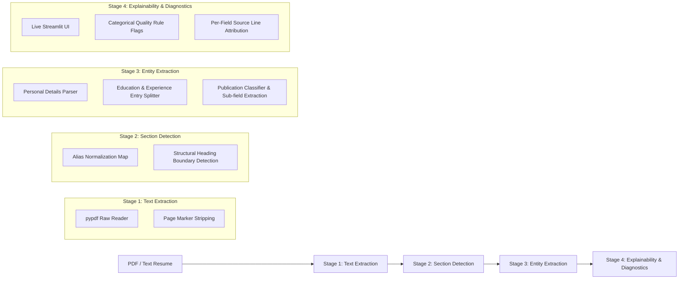

# NLU-Based Resume Information Extraction and Recruitment System

An NLU-driven end-to-end resume information extraction, sectioning, structured entity parsing, explainability diagnostic UI, and recruitment recommendation pipeline.

---

## 🏗️ Pipeline Architecture

The system processes raw PDF and text resumes through a modular 4-stage pipeline:



1. **Stage 1: Text Extraction**: Extracts raw text lines from PDF bytes using `pypdf`, preserving original spacing and layout structures while stripping page markers.
2. **Stage 2: Section Detection**: Normalizes raw heading variants into canonical section keys (`education`, `experience`, `skills`, `publications`, etc.) using a JSON lookup map and enforces structural boundary closure for unmapped headings.
3. **Stage 3: Entity Extraction**: Splits dense section blocks into discrete entry records and extracts granular sub-fields (job titles, dates, degrees, institutions, CGPA, graduation years) using deterministic NLU rules.
4. **Stage 4: Explainability & Diagnostic Layer**: A local web interface (Streamlit) that displays live stage-by-stage status, source line attribution, reason-for-missing mappings, and quality rule flags.

---

## 📊 Final 25-Field Pipeline Accuracy Metrics

The extraction pipeline is evaluated end-to-end against 10 ground-truth academic resumes across 25 fields. Below is the full strict accuracy metrics table produced by `scratch/evaluate_pipeline.py`:

| FIELD NAME | PRECISION | RECALL | F1 SCORE |
| :--- | :---: | :---: | :---: |
| `certifications` | 58.23% | 61.53% | **58.83%** |
| `education_cgpa` | 44.44% | 38.89% | **41.27%** |
| `education_degree` | 81.48% | 42.96% | **53.42%** |
| `education_graduation_year` | 86.67% | 55.93% | **63.06%** |
| `education_institution` | 52.78% | 29.63% | **36.54%** |
| `experience_dates` | 67.59% | 50.00% | **52.90%** |
| `experience_institution` | 91.01% | 56.02% | **65.45%** |
| `experience_title` | 93.33% | 62.04% | **69.65%** |
| `personal_email` | 88.89% | 88.89% | **88.89%** |
| `personal_name` | 77.78% | 77.78% | **77.78%** |
| `personal_phone` | 77.78% | 72.22% | **74.07%** |
| `projects` | 44.44% | 42.13% | **43.15%** |
| `publications_book_chapters` | 74.69% | 70.79% | **72.12%** |
| `publications_books` | 77.78% | 77.78% | **77.78%** |
| `publications_communications` | 88.89% | 88.89% | **88.89%** |
| `publications_conference_papers` | 60.96% | 60.29% | **60.56%** |
| `publications_conference_proceedings` | 90.68% | 86.77% | **88.27%** |
| `publications_journal_articles` | 57.54% | 51.34% | **46.05%** |
| `publications_preprints` | 63.43% | 61.28% | **62.18%** |
| `publications_technical_reports` | 88.89% | 88.89% | **88.89%** |
| `references` | 53.73% | 42.88% | **46.48%** |
| `research_interests` | 74.25% | 82.09% | **75.62%** |
| `responsibilities` | 77.12% | 75.04% | **76.01%** |
| `skills` | 79.81% | 81.52% | **78.02%** |
| `summary` | 52.47% | 55.56% | **53.76%** |
| **AVERAGE MACRO FIELD F1 (25 FIELDS)** | | | **65.59%** |

---

## 🔍 Known Pipeline Limitations

1. **Institution Extraction Ceiling**: The keyword-driven approach (`University`, `Institute`, `College`, `IIT`, `NIT`, `IIIT`, `IIM`) extracts standard academic institutions reliably, but cannot extract non-standard corporate names (e.g. startup companies or private laboratories) that lack explicit organizational keywords.
2. **Narrative / Prose-Style Skills Sections**: When a candidate writes their skills section as narrative paragraphs rather than itemized bullet points, list-splitting cannot reliably separate individual skills. Rather than returning false bullet points, the pipeline raises an explicit quality flag (`possible_narrative_skills_not_itemized`).
3. **Complex Multi-Column Headers**: Resumes with dense multi-column headers merged by PDF text extractors can occasionally obscure candidate name boundaries. The pipeline uses multi-space splitting and title-word filtering to mitigate this.

---

## 🛠️ How to Run & Local Web UI

### 1. Launch the Live Streamlit Explainability App locally
To upload resumes and view live stage-by-stage diagnostics:

```bash
streamlit run src/explainability/streamlit_app.py
```

### 2. Run Automated Regression & Evaluation Scripts

- **Run Strict 25-Field Evaluation**:
  ```bash
  python scratch/evaluate_pipeline.py
  ```

- **Run Personal Details Regression Test**:
  ```bash
  python scratch/test_personal_fields_regression.py
  ```

- **Run Coverage & Routing Accuracy Evaluator**:
  ```bash
  python scratch/evaluate_coverage_routing.py
  ```